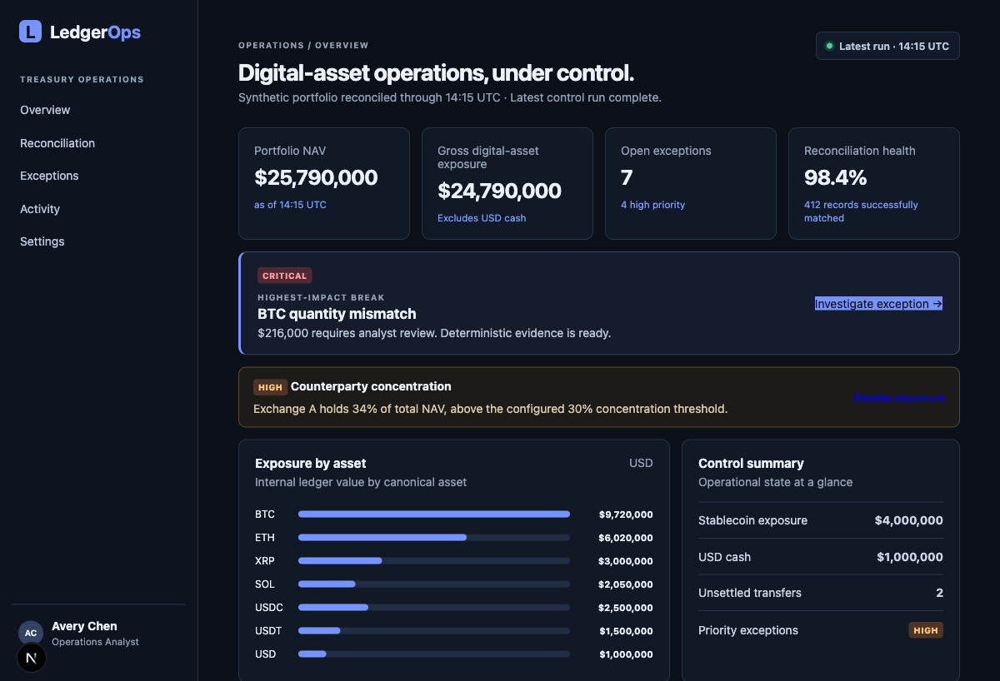
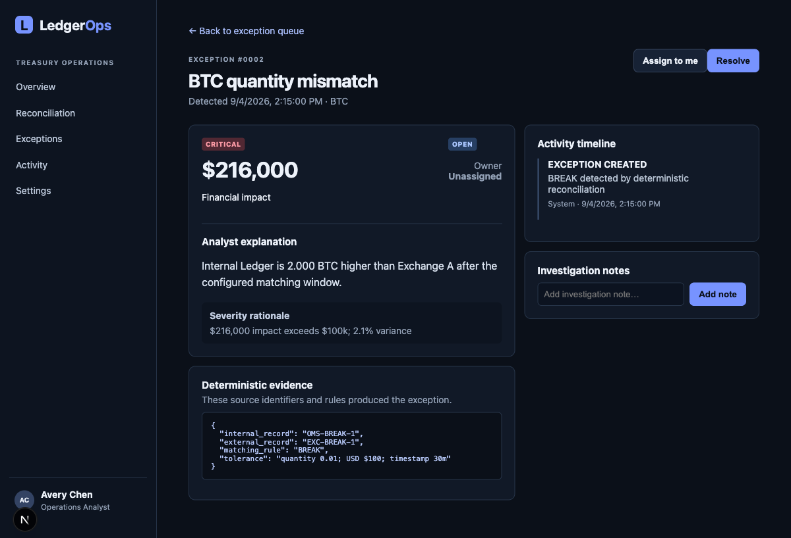
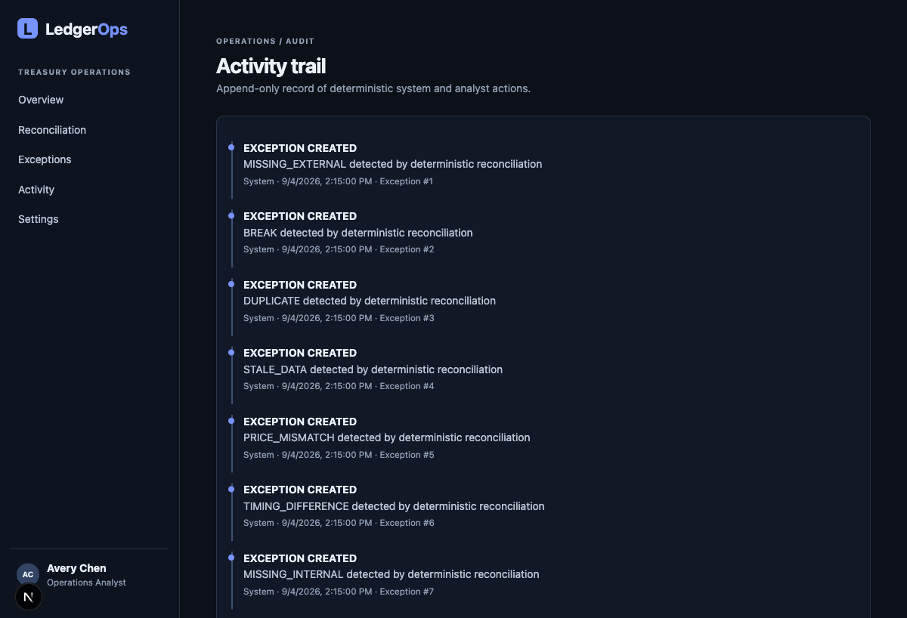

# LedgerOps

**Institutional digital-asset reconciliation and exception management, built for a 90-second operational demo.** LedgerOps gives a treasury or operations analyst one controlled view of synthetic positions across an internal ledger, exchanges, custodians, and wallets—then turns material discrepancies into explainable, auditable work.

> All data is synthetic. LedgerOps contains no real client, trading, exchange, custodian, or wallet data, requires no credentials, and is not affiliated with any exchange, custodian, Ripple, or financial institution.

## Live demo

[Open the public LedgerOps demo →](https://ledgerops-eta.vercel.app)

## What it demonstrates

- A ~$25.79M synthetic institutional portfolio and 388 source records, immediately ready to inspect.
- Deterministic reconciliation with 412 matched items and 7 deliberate operational breaks.
- A high-impact exception queue, evidence view, analyst assignment/resolution, and append-only activity trail.
- Transparent exposure, stablecoin, and counterparty-concentration controls.

## Product snapshots

### Overview



### Exception investigation



### Audit activity



## Architecture

```text
Next.js / TypeScript UI
  ├─ institutional overview, reconciliation, exception, activity, settings views
  └─ API proxy for safe browser-side analyst actions
              │
FastAPI / SQLAlchemy API
  ├─ source adapters: internal ledger, exchange, custodian, wallet
  ├─ deterministic reconciliation and severity rules
  ├─ synthetic seeded database and safe reset endpoint
  └─ SQLite (or Postgres via DATABASE_URL)
```

Source-specific schemas are isolated in adapters before becoming canonical positions. Reconciliation is deliberately deterministic: every match or break is driven by asset, account/venue mapping, ID, amount, timestamp window, and explicit tolerances. Evidence records the source IDs and matching rule that produced the result.

AI is intentionally absent from financial correctness: it never decides balances, reconciliation, calculations, or severity. The current analyst explanation is a deterministic template grounded in the stored evidence.

## Intentional synthetic breaks

The repeatable seed includes a missing USDC settlement, BTC quantity mismatch, duplicate ETH transaction, stale wallet snapshot, XRP mark discrepancy, settlement timing difference, and missing exchange withdrawal. It also includes exact and within-tolerance matches.

## 90-second walkthrough

1. Open **Overview**. Call out the $25.79M NAV, 98.4% reconciliation health, and the concentration warning.
2. Select **Investigate exception** on the highlighted $216K BTC mismatch.
3. Show the human-readable explanation, severity rationale, and exact deterministic source evidence.
4. Assign the exception to yourself and mark it resolved.
5. Open **Activity** to show the audit events created by that action.
6. Return to **Overview** and point out the exposure controls. Use **Settings → Reset synthetic demo** before the next demo if needed.

## Local setup

```bash
python3 -m venv .venv
.venv/bin/pip install -r backend/requirements.txt
.venv/bin/python -m backend.seed
.venv/bin/uvicorn backend.main:app --reload --port 8000
```

In a second terminal:

```bash
cd frontend
npm install
npm run dev
```

Open http://localhost:3000. The frontend proxies browser actions under `/api/*` to FastAPI.

## Verification

```bash
.venv/bin/pytest backend/tests -q
cd frontend && npm run build
```

## Deployment

The public demo uses two Vercel production projects: a Next.js frontend at [ledgerops-eta.vercel.app](https://ledgerops-eta.vercel.app) and a FastAPI serverless function at [ledgerops-api.vercel.app](https://ledgerops-api.vercel.app). The frontend’s server-side API URL is configured as a Vercel environment variable; browser actions proxy through `/api/*`.

The API uses a narrow CORS allowlist (`localhost` plus `FRONTEND_ORIGIN`). `POST /demo/reset` is intentionally unauthenticated only because this is a public, synthetic portfolio demo; it resets no data outside its own demo database.
